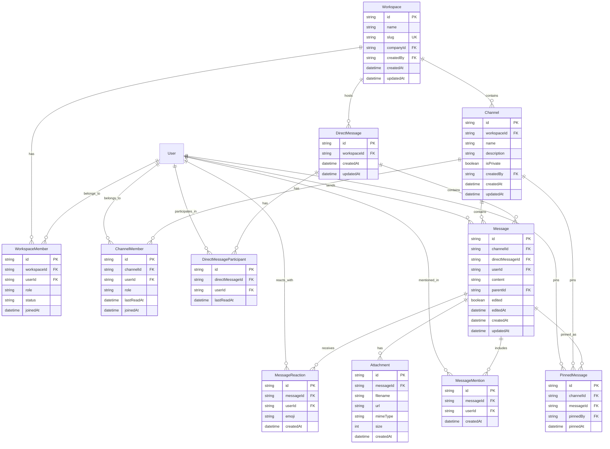

# Entity Relationship Diagram (ERD) FalconERP

Diagram ini dibuat berdasarkan skema Prisma di `prisma/schema.prisma`.

## Diagram Inti Bisnis

## Diagram Sistem Komunikasi (Slack Clone)

## Catatan

- PK: Primary Key
- UK: Unique Key
- FK: Foreign Key
- Relasi `||--o{` menunjukkan one-to-many (satu ke banyak).
- Relasi `||--||` menunjukkan one-to-one (tidak digunakan banyak di sini).
- Enum dan tipe data lain dihilangkan untuk kesederhanaan.

Diagram ini memberikan gambaran visual tentang hubungan antar tabel dalam database FalconERP. Untuk detail lengkap tipe data dan konstrain, lihat file `prisma/schema.prisma`.
